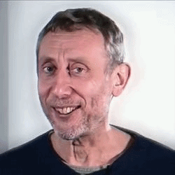
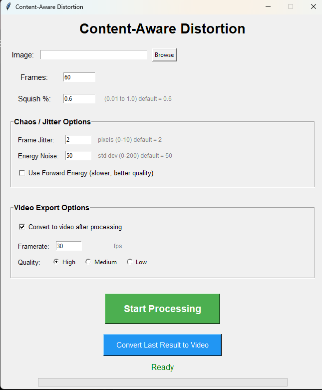

<h1 align="center"> Seam-Carving-Meme-Generator </h1>

<p align="center">
<a href="https://www.python.org/downloads/"></a>
<a href="https://developer.nvidia.com/cuda-toolkit"></a>
<a href="#"></a>
<a href="https://www.gnu.org/licenses/gpl-3.0"></a>
</p>

## GPU-accelerated content-aware image resizing for creating distorted animations.

<p align="center">  </p>

---

*Skip the installation process and jump straight into the action by going to **[Releases](https://github.com/Panicdisress/seam-carving-meme-generator/releases)** page.*

---

### ✨ Features

* **⚡ GPU-Accelerated** – 10-20x faster than CPU using CuPy/CUDA kernels.
* **🎯 Content-Aware** – Intelligent seam carving algorithm that preserves important image details.
* **🌀 Customizable Chaos** – Adjust **Frame Jitter** and **Energy Noise** for unique, glitchy effects.
* **🎬 Built-in Video Export** – Integrated FFmpeg support to convert frames to MP4 instantly.
* **🖥️ User-Friendly GUI** – Simple Tkinter-based interface; no coding required to run.
* **⚙️ Fine-Tuned Control** – Toggle **Forward Energy** for higher quality results at the cost of speed.

---

| Original Image | 400 x 400 px Compression | 250 x 250 px Compression |
| :---: | :---: | :---: |
|  |  |  |
| **Time taken** | `1.4 min.` | `33 sec.` |

## Fully 📸functional UI with inbuild video conversion.⬇️
<p align="center">
  
</p>

---

### 🚀 Quick Start
### *Prerequisites*
* **NVIDIA GPU** (Required for CuPy/CUDA acceleration).
* **Python 3.8+**
* **FFmpeg** (Added to system PATH for video export).

### Installation
```bash
# Clone the repository
git clone https://github.com/Panicdisress/seam-carving-meme-generator
cd content-aware-meme
# Install dependencies (includes CUDA runtime)
pip install -r requirements.txt
```
*or just download the **[Build](https://github.com/Panicdisress/seam-carving-meme-generator/releases)** file .*

### Use
Run the `launch_gui.bat` file.

---

## 🎛️ Parameter Guide

| Parameter | Type | Default | Description |
| :--- | :--- | :--- | :--- |
| **Frames** | Integer | `60` | Total number of frames to generate for the animation sequence. |
| **Squish %** | Float | `0.6` | The amount of horizontal distortion (0.01 to 1.0). Higher = intense effect. |
| **Frame Jitter** | Pixels | `2` | Adds per-frame random pixel shifts (0-10) for a "shaking" effect. |
| **Energy Noise** | Std Dev | `50` | Injects randomness (0-200) into seam selection for chaotic warping. |
| **Forward Energy** | Toggle | `OFF` | Use look-ahead algorithms to reduce artifacts (Slower, but higher quality). |
| **Framerate** | FPS | `30` | The playback speed of the exported MP4 video. |
| **Quality** | Select | `High` | Compression level for the final FFmpeg video export. |

---

### 💡 Pro-Tips for Best Results

* **For Smooth Warping:** Keep `Frame Jitter` at 0 and `Energy Noise` below 20.
* **For Maximum Chaos:** Crank `Energy Noise` to 100+ and `Frame Jitter` to 5.
* **Resolution Tip:** For the fastest GPU performance, use source images with a width under **512px**.
* **Video Export:** If you change your mind about the framerate after processing, just click **"Convert Last Result to Video"** to re-render without re-calculating the seams!

### 📏 Image Size:
* less than  512px: lightning fast⚡
* 512-1080px: slow but steady ✓
* greater than 1080px: Very slow but possible 🐌

---

### 🛠️ Libraires:
* **CuPy**: For GPU-accelerated array computing.

* **OpenCV**: Image manipulation and frame handling.

* **Tkinter**: Lightweight desktop GUI.

* **FFmpeg**: Backend for high-quality video encoding.

---

## 🚧 Limitations & Future Scope

**Current Limitations:**
* **Input Format:** The application currently only supports static **image input** for the initial generation. It cannot process a video as the source file yet.

**Future Scope:**
* **Video-to-Video Pipeline:** I am looking into developing an optimized effect for direct video-to-video processing, allowing you to warp existing video files frame-by-frame.

---

## 🤖 AI Development Note

*I am not a coder. I don’t claim to be one, nor do I have the professional skillset. I am simply an enthusiast. I use AI to achieve my goals. Because I have a foundation in basic coding from school and college, I understand the logic well enough to guide these models and steer them to fulfill my tasks. This project is the result of that partnership.*

### AI Contributions:
* **Optimization:** Algorithm refactoring and CUDA memory management.
* **Debugging:** Error correction and edge-case handling.
* **Documentation:** Drafting structure and technical explanations.
* **Fine-Tuning:** Parameter range suggestions and performance balancing.

### Human Oversight:
* ✅ **Validation:** All code was reviewed, tested, and validated by human developers.
* ✅ **Design:** Core algorithm logic and creative direction remain human-led.
* ✅ **Testing:** Performance benchmarks and manual validation conducted on local hardware.

---

## 🔧 Troubleshooting

### ❌ "CUDA not available"
* **Check Drivers:** Ensure the latest NVIDIA drivers are installed.
* **Verify CuPy:** Run `pip show cupy-cuda11x` (replace `11x` with your version) to ensure the GPU-specific library is installed.
* **Compatibility:** Verify your GPU supports CUDA compute capability 3.0 or higher.

### ❌ "Out of GPU memory"
* **Downscale:** Reduce input image resolution (recommended `< 512px`).
* **Batching:** Lower the total **Frame Count** in the GUI.
* **VRAM Check:** Close other GPU-intensive applications.


### ❌ Slow Performance
* **Resolution:** High-res images (1080p+) scale exponentially in processing time.
* **Forward Energy:** Disable this option in the GUI for a significant speed boost.
* **Utilization:** Check Task Manager/nvidia-smi to ensure the Python process is hitting the GPU.

### ❌ Video Export Fails
* **FFmpeg Path:** Ensure [FFmpeg](https://ffmpeg.org/download.html) is installed and added to your System PATH.
* **Frame Check:** Verify that the `output_frames/` folder contains generated `.png` files.
* **Permissions:** Ensure the application has write access to the project directory.

---

## 🙏 Acknowledgments
The core logic is directly taken from andrewdcampbell's fast python based implementation.
**[andrewdcampbell](https://github.com/andrewdcampbell/seam-carving)**
